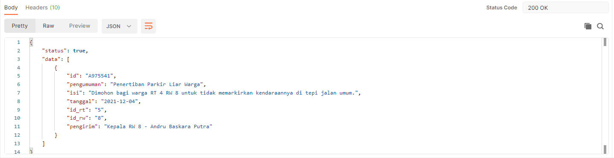

# API Guide

By Rafli

Berikut dibawah merupakan endpoint terbaru dari API ini.

Versi 2.0.0

## Endpoints (Not finished!)

Hanya endpoint dengan method GET dan Login, Logout yang sudah dites

| Route | Method | Output | Keterangan |
| - | - | - | - |
| http://localhost/o-semar-fork/api/rest.php?function=test | GET |  | Untuk testing output API |
| http://localhost/o-semar-fork/api/rest.php?function=test | POST |  | Untuk testing output API jika user sudah terautentikasi atau belum |
| http://localhost/o-semar-fork/api/rest.php?function=login | POST |  | Login user |
| http://localhost/o-semar-fork/api/rest.php?function=penduduk | GET |  | Mengambil data penduduk (Gatau untuk apa) |
| http://localhost/o-semar-fork/api/rest.php?function=kk&kk=nomor_kk | GET |  | Mengambil data penduduk berdasarkan No. KK |
| http://localhost/o-semar-fork/api/rest.php?function=jenis_surat | GET |  | Melihat jenis surat (Gatau untuk apa) |
| http://localhost/o-semar-fork/api/rest.php?function=lampiran_by_id&id=nomor_kk&jenis_lampiran=tulis_jenis_lampiran | GET |  | Mengambil lampiran sesuai KK user |
| http://localhost/o-semar-fork/api/rest.php?function=laporan&nik=nomor_nik | GET |  | Mengambil laporan berdasarkan KK user |
| http://localhost/o-semar-fork/api/rest.php?function=pengumuman&id_rt=no_rt&id_rw=no_rw | GET |  | Mengambil pengumuman berdasarkan RT dan RW |
| http://localhost/o-semar-fork/api/rest.php?function=surat&nik=no_nik | GET |  | Untuk mengambil data surat sesuai KK user |
